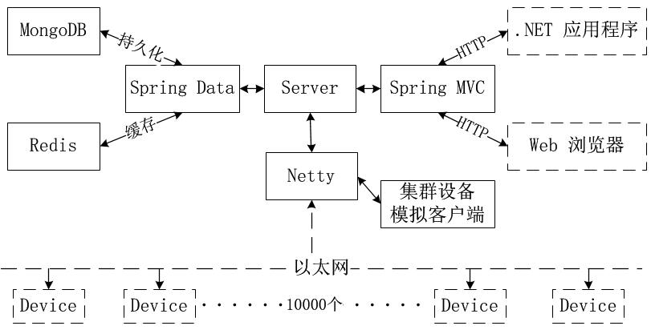
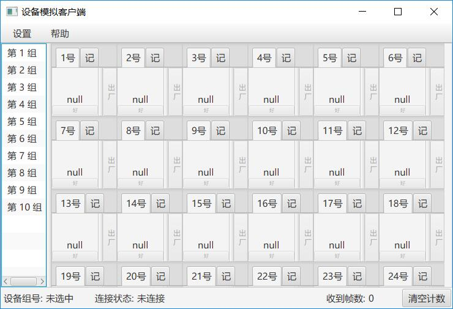
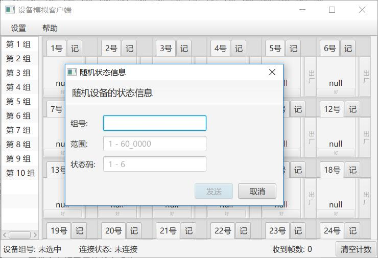

# 基于 Spring 和 Netty 的集群设备管理平台
# 厉害了亮亮

## 项目描述

Java 后端项目，大规模集群设备的管理平台，使用 Spring 作为基础框架，使用 Netty 搭建 TCP 服务器与**上万台设备**组成的集群通信，使用基于 JavaFX 的图形界面应用程序模拟上万台设备的行为，并可对服务器进行压力测试。

### Java 服务器运行环境

- JRE：Java SE 8u121 及以上环境测试通过

- 操作系统：在 Windows 7 及以上，CentOS、Ubuntu 等系统下测试通过

- 数据库：MongoDB 3.4.0 下测试通过

- IDE：IntelliJ IDEA 2017

- 构建工具：Maven

**注**：在运行 Java 服务器前，需预先正确部署并启动 MongoDB 数据库

### 项目主框架

>该模型为实际项目模型的抽象，实际项目中，上万台设备通过 CAN 总线连接，并通过「CAN 转以太网模块」和 Java 服务器通信，本模型抽象为上万台设备通过一条 TCP 连接和服务器进行通信，设备区分依靠自定义帧格式。

## Java 服务器

### 服务器架构描述

- 以 Spring 为基础框架，集成 Netty、Spring Data、Spring MVC 等框架搭建服务器。

- 采用 Netty 开发 TCP 服务器，与至少 1W 台设备「智能充电柜」进行通信，处理能力 200 帧/秒以上，已有效解决粘包、半包问题。遵循 CAN 协议自定义帧格式，实现丰富的业务功能。

- 采用 MongoDB，对设备集群的状态信息进行持久化。

- 采用 Spring MVC，为 .NET 及 Web 客户端提供 RESTFul API 风格的 HTTP 服务。

- 采用 Redis 作为数据库的缓存，极大提升数据库的使用效率，并将服务器对帧的处理效率提升2个数量级以上。

### Netty 服务器设计方案

本节内容总结为以下文章，点击查看：

[基于 Netty 的自定义帧高可靠性读取方案](http://www.jianshu.com/p/7b1010e7e293)

### 帧调度算法概述

>本节介绍 Java 服务器中，Netty 模块使用的帧调度算法，由于众多硬件设备的**数据帧处理能力较差**，**可靠性较差**，服务器大规模下发数据帧时，需进行有效的**拥塞控制、超时重发**，可有效提升集群设备的可靠性，降低集群设备的研发难度。

内容较多，这部分内容被放在了独立博文中，请使用如下链接查看：

[基于 Netty 的帧调度策略，自行实现流量控制及可靠性通信](http://www.jianshu.com/p/c5da14855515)

「注」本部分为源码「Netty服务器」部分的解释说明，需结合源码进行阅读。

## JavaFX 设备模拟客户端

基于 JavaFX 开发 GUI 客户端，模拟集群设备的行为，并可对服务器进行压力测试。

本程序开发时，相关技巧和填坑总结为以下文章：

[JavaFX 8 下简化自定义控件的外部调用以及流式布局示例](http://www.jianshu.com/p/9b5300b44f39)

[Maven 集成 JavaFX 8 以及 fx:root 问题探讨](http://www.jianshu.com/p/fce816babefc)

### 模拟客户端主界面

### 模拟集群设备的行为进行压力测试

## [License](https://github.com/bitkylin/ClusterDeviceControlPlatform/blob/master/LICENSE)

> MIT License
> 
> Copyright (c) 2017 123lml123
> 
> Permission is hereby granted, free of charge, to any person obtaining a copy
> of this software and associated documentation files (the "Software"), to deal
> in the Software without restriction, including without limitation the rights
> to use, copy, modify, merge, publish, distribute, sublicense, and/or sell
> copies of the Software, and to permit persons to whom the Software is
> furnished to do so, subject to the following conditions:
> 
> The above copyright notice and this permission notice shall be included in all
> copies or substantial portions of the Software.
> 
> THE SOFTWARE IS PROVIDED "AS IS", WITHOUT WARRANTY OF ANY KIND, EXPRESS OR
> IMPLIED, INCLUDING BUT NOT LIMITED TO THE WARRANTIES OF MERCHANTABILITY,
> FITNESS FOR A PARTICULAR PURPOSE AND NONINFRINGEMENT. IN NO EVENT SHALL THE
> AUTHORS OR COPYRIGHT HOLDERS BE LIABLE FOR ANY CLAIM, DAMAGES OR OTHER
> LIABILITY, WHETHER IN AN ACTION OF CONTRACT, TORT OR OTHERWISE, ARISING FROM,
> OUT OF OR IN CONNECTION WITH THE SOFTWARE OR THE USE OR OTHER DEALINGS IN THE
> SOFTWARE.

## 关于我

### 1. 我的主页

名称|二级域名|原始地址
---|---|---
主页|http://bitky.cc|https://bitkylin.github.io
GitHub|http://github.bitky.cc|https://github.com/bitkylin
简书|http://js.bitky.cc|http://www.jianshu.com/u/bd2e386a6ea8
CSDN|http://csdn.bitky.cc|http://blog.csdn.net/llmmll08

### 2. 其他

- 兴趣方向: Java, Android, C#, JavaScript, Node.js, Kotlin 等

- Email: bitkylin@163.com
