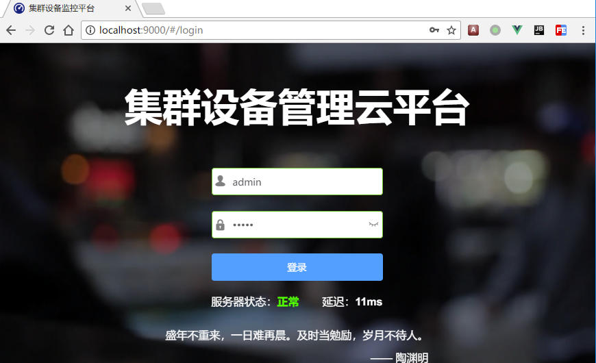
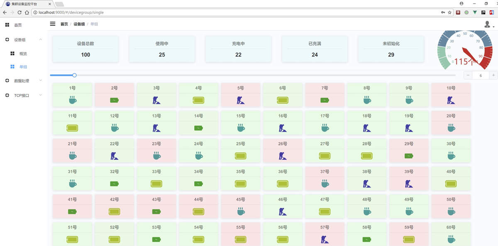
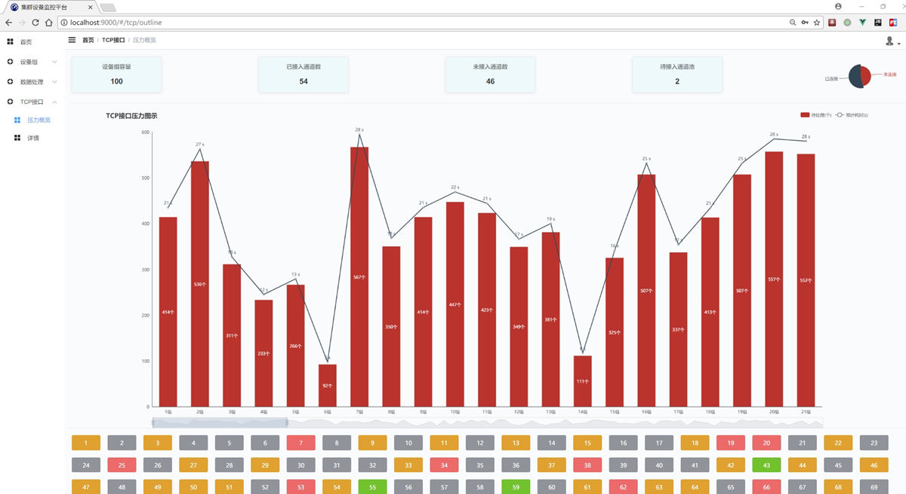
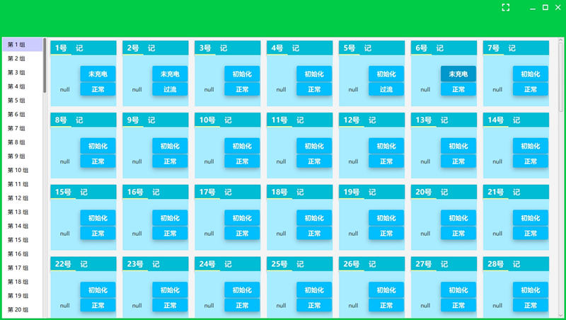
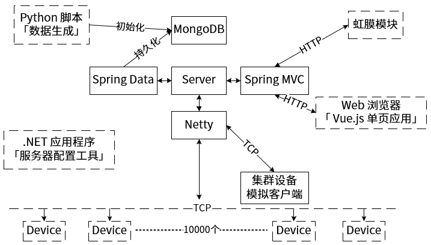

# 集群设备管理云平台「Java、SPA、Spring Boot 2.0、Netty、Vue.js 2.0、Element 2.0」

[](https://github.com/bitkylin/ClusterDeviceControlPlatform/stargazers)
[](https://travis-ci.org/bitkylin/ClusterDeviceControlPlatform)
[](https://github.com/bitkylin/ClusterDeviceControlPlatform/blob/master/LICENSE)


## 项目描述

Java & Vue.js 全栈项目，大规模集群设备管理云平台，由以下几部分组成：**Java 后端服务器、基于 Vue.js 的 Web 前端「SPA」单页应用程序、JavaFX 集群设备模拟客户端、辅助工具组件「Python 脚本、基于 C# & WPF 的可视化配置工具」**，简要介绍如下：

- **Java 后端服务器**：使用 Spring Boot 作为基础框架，使用 Netty 搭建 TCP 服务器与**上万台设备**组成的集群通信，采用自定义帧格式。

- **基于 Vue.js 的 Web 前端「SPA」单页应用程序**：绚丽的现代化 SPA 应用程序，可视化展现服务器内部的各项数据，包括服务器消息队列、通信压力、实时通信信息等。

- **JavaFX 集群设备模拟客户端**：使用基于 JavaFX 的图形界面应用程序模拟上万台设备的行为，并可对服务器进行压力测试。

- **辅助工具组件**：Python 编写的数据库初始化及测试脚本、C# 编写的基于 WPF 的可视化服务器配置工具。

**注意：[「基于 Vue.js 的 Web 前端「SPA」单页应用程序」为单独的项目，点击此处跳转](https://github.com/bitkylin/ClusterDeviceControlPlatform-Web)**

## 运行方法

**注意：由于涉及部分业务逻辑，主项目未完全开源，所以可使用子项目进行演示，运行方法如下：** 

下载并进入子工程「clusterdeviceplatform-demo」的根目录：

```shell
cd clusterdeviceplatform-demo
```

而后在命令行执行如下命令：

```shell
gradle assemble
```

或者执行：

```shell
gradle build
```
稍后即可生成 jar 文件，找到并执行该 jar 文件即可：

```shell
cd build\libs
java -jar -Dfile.encoding=UTF-8 clusterdeviceplatform-demo-1.0.0.jar
```

而后进入[配套的 Web 前端项目](https://github.com/bitkylin/ClusterDeviceControlPlatform-Web)，根据该项目的说明，即可成功构建并运行 Web 页面。

**当然，以上运行说明并不完善，详细的构建方法及方便的一键构建脚本，可参考如下两篇文章：**

1. [使用 Linux 子系统部署 Node、Gradle 项目的构建工具](https://www.jianshu.com/p/f34d1f2e329c)

2. [Windows 10 用于 Linux 子系统的一键构建、打包脚本「 Node、Gradle 项目」](https://www.jianshu.com/p/6c78f35e228e)

## 项目图示

### 1. 基于 Vue.js 的 Web 前端「SPA」单页应用程序

**Web 登录页面**



**Web 单设备组详细信息显示**



**Web 服务器压力图示**



### 2. JavaFX 集群设备模拟客户端

**Web 模拟客户端主界面重新设计**



**Web 模拟客户端主界面**


**Web 模拟客户端的压力测试功能**


## Java 服务器

### Java 服务器运行环境

- JRE：Java SE 8u121 及以上环境测试通过

- 操作系统：在 Windows 7 及以上，CentOS、Ubuntu 等系统下测试通过

- 数据库：MongoDB 3.4.0 下测试通过

- IDE：IntelliJ IDEA 2017

- 构建工具：Gradle


**注**：在运行 Java 服务器前，需预先正确部署并启动 MongoDB 数据库

### 系统架构图示



### 服务器架构描述

- 以 Spring Boot 为基础框架，集成 Netty、Spring Data、Spring MVC 等框架搭建服务器。

- 采用 Netty 开发 TCP 服务器，与至少 1W 台设备进行通信，处理能力 2000 帧/秒以上，已有效解决粘包、半包问题。遵循 CAN 协议自定义帧格式，实现丰富的业务功能。

- 采用 MongoDB，对设备集群的状态信息进行持久化。

- 采用 Spring MVC，为 .NET 及 Web 客户端提供 RESTFul API 风格的 HTTP 服务。

- 在服务器程序内部采用多种数据结构对数据进行缓存处理，并大量采用线程池等，极大提升数据库的使用效率，将服务器对帧的处理效率提升 2 个数量级以上。

### Netty 服务器设计方案

本节内容总结为以下文章，点击查看：

[基于 Netty 的自定义帧高可靠性读取方案](http://www.jianshu.com/p/7b1010e7e293)

### 帧调度算法概述

>本节介绍 Java 服务器中，Netty 模块使用的帧调度算法，由于众多硬件设备的**数据帧处理能力较差**，**可靠性较差**，服务器大规模下发数据帧时，需进行有效的**拥塞控制、超时重发**，可有效提升集群设备的可靠性，降低集群设备的研发难度。

内容较多，这部分内容被放在了独立博文中，请使用如下链接查看：

[基于 Netty 的帧调度策略，自行实现流量控制及可靠性通信](http://www.jianshu.com/p/c5da14855515)

「注」本部分为源码「Netty服务器」部分的解释说明，需结合源码进行阅读。

## JavaFX 设备模拟客户端

基于 JavaFX 开发 GUI 客户端，模拟集群设备的行为，并可对服务器进行压力测试。

本程序开发时，相关技巧和填坑总结为以下文章：

[JavaFX 8 下简化自定义控件的外部调用以及流式布局示例](http://www.jianshu.com/p/9b5300b44f39)

[Maven 集成 JavaFX 8 以及 fx:root 问题探讨](http://www.jianshu.com/p/fce816babefc)

## 基于 Vue.js 的 Web 前端「SPA」单页应用程序

绚丽的现代化 SPA 应用程序，可视化展现服务器内部的各项数据，包括服务器消息队列、通信压力、实时通信信息等。

该应用开发时，设计经验总结可见以下文章：

[基于 Vue.js 2.0 酷炫自适应背景视频登录页面的设计](https://www.jianshu.com/p/8097bb3d9d49)

## [License](https://github.com/bitkylin/ClusterDeviceControlPlatform/blob/master/LICENSE)

> MIT License
> 
> Copyright (c) 2018 123lml123
> 
> Permission is hereby granted, free of charge, to any person obtaining a copy
> of this software and associated documentation files (the "Software"), to deal
> in the Software without restriction, including without limitation the rights
> to use, copy, modify, merge, publish, distribute, sublicense, and/or sell
> copies of the Software, and to permit persons to whom the Software is
> furnished to do so, subject to the following conditions:
> 
> The above copyright notice and this permission notice shall be included in all
> copies or substantial portions of the Software.
> 
> THE SOFTWARE IS PROVIDED "AS IS", WITHOUT WARRANTY OF ANY KIND, EXPRESS OR
> IMPLIED, INCLUDING BUT NOT LIMITED TO THE WARRANTIES OF MERCHANTABILITY,
> FITNESS FOR A PARTICULAR PURPOSE AND NONINFRINGEMENT. IN NO EVENT SHALL THE
> AUTHORS OR COPYRIGHT HOLDERS BE LIABLE FOR ANY CLAIM, DAMAGES OR OTHER
> LIABILITY, WHETHER IN AN ACTION OF CONTRACT, TORT OR OTHERWISE, ARISING FROM,
> OUT OF OR IN CONNECTION WITH THE SOFTWARE OR THE USE OR OTHER DEALINGS IN THE
> SOFTWARE.

## 关于我

### 1. 我的主页

名称|二级域名|原始地址
---|---|---
主页|http://bitky.cc|https://bitkylin.github.io
GitHub|http://github.bitky.cc|https://github.com/bitkylin
简书|http://js.bitky.cc|http://www.jianshu.com/u/bd2e386a6ea8
知乎|http://zhi.bitky.cc|https://www.zhihu.com/people/bitkylin


### 2. 其他

- 兴趣方向: Java, Web, Android, Vue.js, C#, JavaScript, Node.js, Kotlin 等

- Email: bitkylin@163.com
